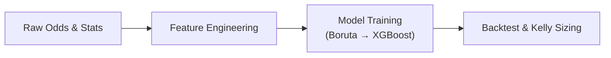

[](https://github.com/bcosm/hoops-spread/actions/workflows/ci.yml)
[](LICENSE)

> End-to-end NCAA point-spread modeling and backtesting built on XGBoost and multi-model sentiment analysis.

Repository by **Baz** — Quant Sports-Betting Lead (Jan 2025-Present), Michigan Finance and Math Society (MFAMS).*
*Active development; production modules clearly identified below.*

## Key Results

| Model Configuration | ROI | Hit Rate | Sample Size |
|-------------------|-----|----------|-------------|
| **Market-Signal Model** | **+2.60%** | 55.8% | 2,587 bets |
| **Fundamental Model** | +0.14% | 53.5% | 3,919 bets |

**Highlights:**
• Profitable edge against closing lines with market-signal integration  
• 50+ subreddit sentiment analysis processed via cascading AI pipeline  
• Strict backtesting with leakage controls and Kelly sizing  
• Production-ready modeling and backtesting modules

---


## Pipeline Stages

| Pipeline Stage                                                  | Readiness            | Location                    |
| --------------------------------------------------------------- | -------------------- | --------------------------- |
| **Modeling (Boruta → XGBoost → SHAP)**                         | **Production-ready** | `/modeling`, `/backtesting` |
| **Backtesting & Kelly sizing**                                 | **Production-ready** | `/backtesting`              |
| **Data collection, feature engineering, sentiment integration** | **In development**   | `/wip/**`                   |

> **Key point.** All source code for every stage is complete and visible in `/wip`. Everything from Boruta forward is fully packaged and reproducible today; the upstream stages are fully functional as standalone scripts, but their orchestration is still being consolidated into a reproducible one-command pipeline.

---


If you'd like to execute some of the early-stage pipelines (found in /wip), download an (8GB) bundle of intermediate .csv and .json files:

**[Download intermediate\_data.zip](https://drive.google.com/file/d/1jAvz6rA_wzG9rsb00sbuUaUzBJdoyAvx/view?usp=sharing)**

Extract to `data/` and proceed to running any of the data collection, feature engineering, or sentiment pipeline scripts.

---


1. [Overview](#overview)
2. [Pipeline Stages](#pipeline-stages)
3. [Quick Start](#quick-start)
4. [Running the Pipeline](#running-the-pipeline)
5. [Methodology Notes](#methodology-notes)
6. [Challenges & Lessons Learned](#challenges--lessons-learned)
7. [Next Steps](#next-steps)
8. [Project Architecture](#project-architecture)
9. [Model Performance](#model-performance)
10. [Dependencies](#dependencies)
11. [License & Notices](#license--notices)
12. [Acknowledgements](#acknowledgements)

---


## Overview

This repository provides a transparent, reproducible workflow for NCAA point-spread prediction.

* **Finalized components** (ready for use)

  * Historical line scraping, data cleaning and merging
  * Rolling team statistics and pacing metrics
  * Memory-efficient cascading sentiment pipeline (VADER → Flair → DistilBERT + sarcasm) based on discussion from 50+ subreddits
  * Boruta feature selection
  * Optuna-tuned XGBoost model
  * SHAP-based attribution
  * Backtesting with Kelly staking
* **Components in progress**

  * Packaging data collection, feature engineering, and sentiment analysis into easily reproducible pipelines
  * Additional predictors under development by MFMS analysts (referee tendencies, travel logistics, injury availability, sleep deprivation)


---


## Quick Start

**Not financial advice / gamble responsibly**


**Requires Python 3.11**

```bash
git clone https://github.com/bcosm/hoops-spread.git
cd hoops-spread
pip install -e .
```


```bash
hoops-spread all
```

Execution time \~15 minutes on a modern laptop with the dataset found in data/features.

---


## Running the Pipeline

| Task              |  CLI                     | Script                      |
| ----------------- | ----------------------- | --------------------------- |
| Model training    |  `hoops-spread modeling` | `python hoops_spread/model_pipeline.py` |
| Backtest         |  `hoops-spread backtest` | `python tools/pipeline.py` |
| Train + Backtest |  `hoops-spread all`      | –                           |

Early-stage commands (data collection, feature engineering, sentiment) are present but not yet fully working.

---


## Methodology Notes

Quantitatively assess how novel information sources improve NCAA point-spread prediction. Each candidate factor is integrated, backtested, and stress-tested before promotion to production. **Reddit sentiment** is the first such factor to reach the production pipeline.


Hand-engineered team metrics (pace, efficiency, SOS, travel distance, altitude) are combined with multi-model sentiment scores. Boruta performs variable selection to reduce dimensionality and guard against noise.
A single Boolean switch in the Boruta script toggles whether the **opening total line** (`open_total`) is passed downstream:

* **Fundamental profile** – 98 features, excludes `open_total`
* **Market-signal profile** – 99 features, includes `open_total`


Gradient-boosted decision trees (XGBoost) were selected for their performance on structured data, monotonic constraint capabilities, and transparent regularization. Optuna executes a 50-trial Bayesian search per retraining cycle; cross-validation folds are aligned on calendar weeks to eliminate temporal leakage.


* **Simulated stake sizing.** Simulated stakes follow half-Kelly sizing on model-derived edge probabilities; bankroll trajectories are monitored with VaR and maximum draw-down limits.
* **Leakage controls.** All pipeline steps enforce strict chronological splits, and sentiment windows lag game start by 24 hours to avoid post-game contamination.


A cascading sentiment pipeline combines fast, medium, and high-accuracy models in a memory-efficient stream:

* **VADER → Flair → DistilBERT (+ sarcasm detection)**
* Only high-uncertainty texts are escalated to heavier models.
* Hash-based deduplication avoids reprocessing similar content.
* Runs under 4GB RAM on 20GB+ datasets; full daily sentiment timelines generated per team.

This setup enables scalable, cost-effective analysis of large social datasets while retaining model accuracy through selective refinement.


---


## Challenges & Lessons Learned

| Area                    | Challenge                                                                       | Mitigation & Outcome                                                                                         |
| ----------------------- | ------------------------------------------------------------------------------- | ------------------------------------------------------------------------------------------------------------ |
| Data Quality            | Inconsistent school names, duplicated tip-off timestamps, mid-game line updates | Implemented deterministic name mapping and time-series deduplication; used locally-run LLM/OpenRouter to intelligently assign aliases and school codes. |
| Feature Leakage         | Risk of future information bleeding into training windows                       | Adopted strict cut-off dates, lagged rolling features, and calendar-aligned cross-validation.                |
| Hyperparameter Over-fit | Large search space via Optuna                                                   | Nested CV with early stopping on generalization loss; search capped at 50 trials.                            |
| Risk/Reward Balance     | Aggressive Kelly sizing can increase draw-down                                  | Capped at 50 % Kelly, enforced bankroll stop-loss triggers in backtest.                                     |
| Reddit Data Access      | Reddit's API was rate-limited and crippled post-2023                            | Fetched and locally indexed all 3.5TB of public Reddit posts and comments since 2007 to enable full offline querying and sentiment analysis. |


---


## Next Steps

1. **Integrate new predictor sets**: referee crew tendencies, travel fatigue indices, automated injury feeds.
2. **Automate upstream data pipelines**: migrate `/wip` scripts to production-grade DAG with data versioning.
3. **Expand market coverage**: totals and money-line models using aligned feature sets.
4. **Public research note**: Document comparative uplift of each factor and release under open licence.

---


## Project Architecture

| Stage                  | Outputs                                                                        | Notes                                          |
| ---------------------- | ------------------------------------------------------------------------------ | ---------------------------------------------- |
| **Modeling**          | `artifacts/models/xgb_cover.pkl`, `config/boruta_features_sentiment.txt`      | GPU-accelerated, Optuna search                 |
| **Backtesting**       | `artifacts/models/backtest_summary.json`, `artifacts/models/bet_history.csv`  | ROI, SHAP attribution, Kelly P\&L |
| **Upstream data prep** | *Under development*                                                            | Located in `/wip`                              |

---


```
data/
backtest_results/
hoops_spread/
├── modeling/                ← Production-ready
├── backtesting/             ← Production-ready
├── cli.py                   ← Command-line interface
wip/
models/
tests/
```

---


## Model Performance

| Profile                               | Features | Bets  | ROI (½-Kelly) | 95 % CI             | Hit Rate |
| ------------------------------------- | -------- | ----- | ------------- | ------------------- | -------- |
| **Market-Signal Model Performance**   | 99       | 2 587 | **+2.60 %**   | +2.31 % … +2.86 %   | 55.8 %   |
| **Fundamental Model Performance**     | 98       | 3 919 | **+0.14 %**   | –0.05 % … +0.37 %   | 53.5 %   |


*Window: Seasons ~2020 – 2022, trained on ~2007 - 2019 • Max draw-down ≤ 3.2 units • Half-Kelly staking*

All evaluations use strict walk-forward validation with calendar-aligned splits. No look-ahead bias or post-game sentiment leakage. Every result shown is from out-of-sample evaluation only.

Full reports are stored in `backtest_results`.

---


## Dependencies

**Core libraries**  
`pandas`, `numpy`, `pyarrow`, `scikit-learn`, `xgboost`, `joblib`, `duckdb`,`tqdm`

**Data & scraping**  
`requests`, `beautifulsoup4`, `urllib3`, `python-dotenv`, `rapidfuzz`

---


## License & Notices

* Code released under the **MIT License**.
* Reddit content processed under Reddit’s User Agreement and subject to GDPR/CCPA.

---


## Acknowledgements

* Sportsbook Review — historical odds
* Bart Torvik — advanced metrics
* Reddit.com — sentiment source
* XGBoost authors — core modeling engine

